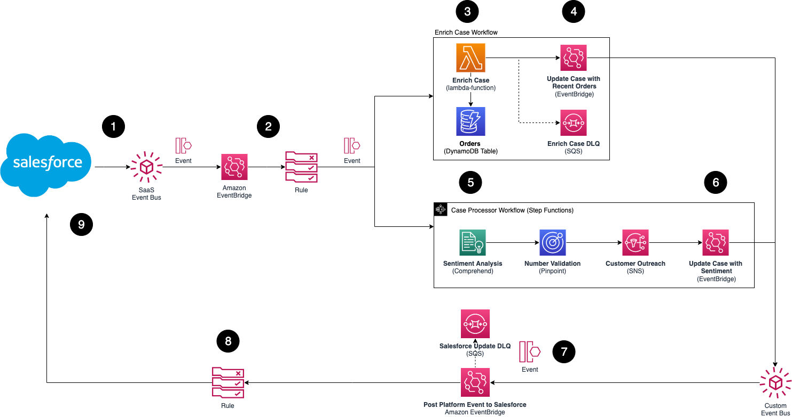

# EventBridge Salesforce Integration

AWS now supports Salesforce as a partner event source for Amazon EventBridge, allowing you to send Salesforce events to AWS. You can also configure Salesforce as an EventBridge API Destination and send EventBridge events to Salesforce. These integrations enable you to act on changes to your Salesforce data in real-time and build custom applications with EventBridge and over 100 built-in sources and targets.
In this blog post, you learn how to set up a bidirectional integration between Salesforce and EventBridge and use cases for working with Salesforce events. You see an example application for interacting with Salesforce support case events with automated workflows for detecting sentiment with AWS AI/ML services and enriching support cases with customer order data.



## Deploy the sample application

This project contains the SAM template and supporting files for a serverless application that you can deploy with the SAM CLI. It includes the following files and folders.

- template.yaml - A template that defines the application's AWS resources.
- stateMachine - Step Functions State Machine to detect customer sentiment and send SMS to the customer.
- src/enrich-case-app - Application to retrieve order details for a customer support case.

### Pre-requisite
To use the SAM CLI, you need the following tools.

* SAM CLI - [Install the SAM CLI](https://docs.aws.amazon.com/serverless-application-model/latest/developerguide/serverless-sam-cli-install.html)
* Node.js - [Install Node.js 10](https://nodejs.org/en/), including the NPM package management tool.
* Docker - [Install Docker community edition](https://hub.docker.com/search/?type=edition&offering=community)
* AWS CLI - [Install & Configure AWS Credentials](https://docs.aws.amazon.com/cli/latest/userguide/cli-chap-configure.html)

### Deployment
To build and deploy your application for the first time, run the following in your shell and follow the prompts

The first command will build the source of your application. The second command will package and deploy your application to AWS, with a series of prompts:

```bash
salesforce-eventbridge-sentiment-analysis$ cd src/enrich-case-app
salesforce-eventbridge-sentiment-analysis$ npm install
salesforce-eventbridge-sentiment-analysis$ cd ../../
salesforce-eventbridge-sentiment-analysis$ sam build
salesforce-eventbridge-sentiment-analysis$ sam deploy --guided
```

* **Stack Name**: The name of the stack to deploy to CloudFormation. This should be unique to your account and region, and a good starting point would be something matching your project name.
* **AWS Region**: The AWS region you want to deploy your app to.
* **Confirm changes before deploy**: If set to yes, any change sets will be shown to you before execution for manual review. If set to no, the AWS SAM CLI will automatically deploy application changes.
* **Allow SAM CLI IAM role creation**: Many AWS SAM templates, including this example, create AWS IAM roles required for the AWS Lambda function(s) included to access AWS services. By default, these are scoped down to minimum required permissions. To deploy an AWS CloudFormation stack which creates or modifies IAM roles, the `CAPABILITY_IAM` value for `capabilities` must be provided. If permission isn't provided through this prompt, to deploy this example you must explicitly pass `--capabilities CAPABILITY_IAM` to the `sam deploy` command.
* **Save arguments to samconfig.toml**: If set to yes, your choices will be saved to a configuration file inside the project, so that in the future you can just re-run `sam deploy` without parameters to deploy changes to your application.

## Cleanup

To delete the sample application that you created, use the AWS CLI. Assuming you used your project name for the stack name, you can run the following:

```bash
salesforce-eventbridge-sentiment-analysis$ aws sam delete --stack-name <stack name>
```

## Resources

See the [AWS SAM developer guide](https://docs.aws.amazon.com/serverless-application-model/latest/developerguide/what-is-sam.html) for an introduction to SAM specification, the SAM CLI, and serverless application concepts.

Next, you can use AWS Serverless Application Repository to deploy ready to use Apps that go beyond hello world samples and learn how authors developed their applications: [AWS Serverless Application Repository main page](https://aws.amazon.com/serverless/serverlessrepo/)

## Security

See [CONTRIBUTING](CONTRIBUTING.md#security-issue-notifications) for more information.

## License

This library is licensed under the MIT-0 License. See the LICENSE file.